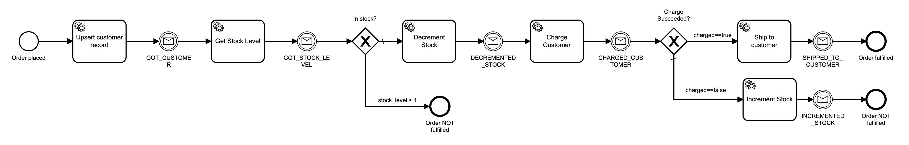
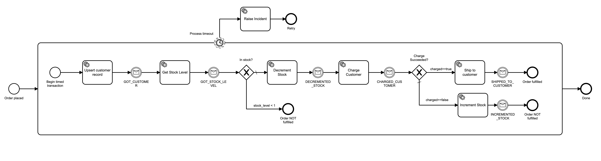
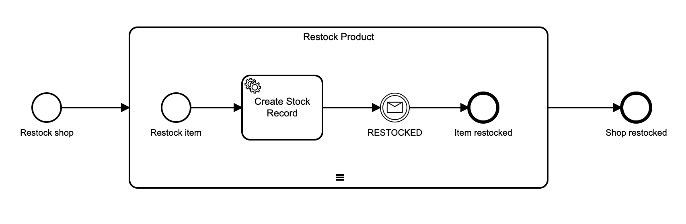

# Advanced Getting Started

In this tutorial, we will look at an ecommerce order flow and correlating messages with instances of workflows.

We will use [GhettoHub DB](https://github.com/jwulf/ghettohub-db) for database persistence for our microservices. They will write to a db folder in this repository, so you will need to configure your Camunda Cloud account so that the Camunda HTTP Worker can trigger GhettoHub DB actions in this repo.

## Configure Camunda Cloud to access this repo

In this section you will create a GitHub Token that will allow the Camunda HTTP Worker to post `repository_dispatch` events to this repository. 

The token will not be available to any code that runs in response to these events, it is used only to authorize the POST request that triggers Actions. Nor will it be visible in any logs, including Operate. We will be using variable substitution to make it available to the Camunda HTTP Worker from secret Worker Variables in your Camunda Cloud account.

* Create a new GitHub Personal Access Token, following [these instructions](https://help.github.com/en/github/authenticating-to-github/creating-a-personal-access-token-for-the-command-line). It needs repo scope.

* Create a new Worker variable in your Camunda Cloud cluster, named `GitHubToken`. Paste the GitHub token in there.

All workflows and commands will use `{{GitHubToken}}` to refer to this token, and only the Camunda HTTP Worker running in Camunda Cloud will have access to its actual value at runtime, to authorize the POST to the `repository_dispatch` endpoint.

## The Order Fulfilment Process

Here is the order fulfilment process that we are implementing:

This flow uses a decoupled async pattern - rather than each microservice completing its task in the service task, the service task acts as a command to the microservice, which messages back its result to the workflow.

In the case of our implementation, this is because the `repository_dispatch` event sent from the `CAMUNDA-HTTP` worker to the worker in the GitHub Action is a one-way communication.

This is also a pattern that you might use if your microservices are buffered by a queuing system, such as RabbitMQ, and send their responses via another queue. Later, we will reimplement this using workers that communicate directly with the broker over gRPC, so you can see what that looks like.

## Dealing with Failure

In coding, getting the happy path to work is 10% - the other 90% is designing for what happens when it _doesn't_ work.

Our process as it stands now deals with some business failure conditions - there is no stock available to fulfil the order, or the customer's payment method was declined.

However, it does not deal with infrastructure failure. What happens if one of the microservices fails to communicate back a result - whether due to a failure in the microservice itself or due to a failure in the queue?

In that case, our process will simply sit there. We need some way to surface that a process has not completed in a timely fashion.

One approach is to put the entire process in a sub-process, and put a boundary timer event on it: 

In this example, we put a [_non-interrupting timer boundary event_](https://docs.zeebe.io/bpmn-workflows/timer-events/timer-events.html#timer-boundary-events) on the sub-process. After some pre-determined interval of time, if our process has not completed, the timer will fire and raise an incident in Operate. This raises visibility of the failure and allows an operator to investigate.

Because it is a _non-interrupting_ event, if the underlying infrastructure recovers after the timeout happens, the process can continue with no intervention. The timer fires once if the process takes too long. 

## GhettoHub DB

The implementation we are going to run uses [GhettoHub DB](https://github.com/jwulf/ghettohub-db) - "_The World's Least Web Scale JSON DB_". It's JSON Database in a GitHub repo through GitHub Actions. Obviously you are not going to use it in production - it is for demo purposes only. It allows the Camunda HTTP Worker to act as a microservice by activating GitHub workflows that create database records in this repo.

## Stocking Inventory

The first thing we will do is populate the stock inventory of our ecommerce store. Here is the BPMN model:

This process uses a [_sequential multi-instance subprocess_](https://docs.zeebe.io/bpmn-workflows/multi-instance/multi-instance.html) to iterate over a collection of products and run the "Restock Product" process for each one. From a programming perspective you can think of it as an `Array.forEach` operation.

We will pass in an array of products (which we get from [this GitHub Action](https://github.com/jwulf/camunda-cloud-demo-data-action/blob/master/src/products.ts)), and it will invoke our inventory microservice for each product, updating the stock level.

The inventory microservice communicates back that the operation is complete, and then the next stock item is updated. We could use a parallel multi-instance, except GhettoHub DB can't write to this repo in parallel, because git conflicts.