# Zero-installation Getting Started with Camunda Cloud 

[](https://www.actionspanel.app/app/jwulf/camunda-cloud-starter)

Getting Started with Camunda Cloud with no code or installation of software, using the [Zeebe GitHub Action](https://github.com/marketplace/actions/zeebe-action).

## Setup

* Fork this repo to your own account.
* Get a [Camunda Cloud](https://camunda.io) Account.
* Create a new client in the Camunda Cloud console.
* Click the button to copy the entire client configuration

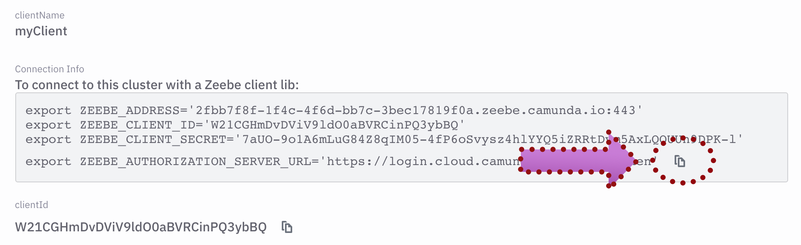

* Create a new secret in your forked repository's Settings > Secrets ([instructions](https://help.github.com/en/actions/configuring-and-managing-workflows/creating-and-storing-encrypted-secrets#creating-encrypted-secrets)). Call it `ZEEBE_CLIENT_CONFIG`, and paste in the client config:

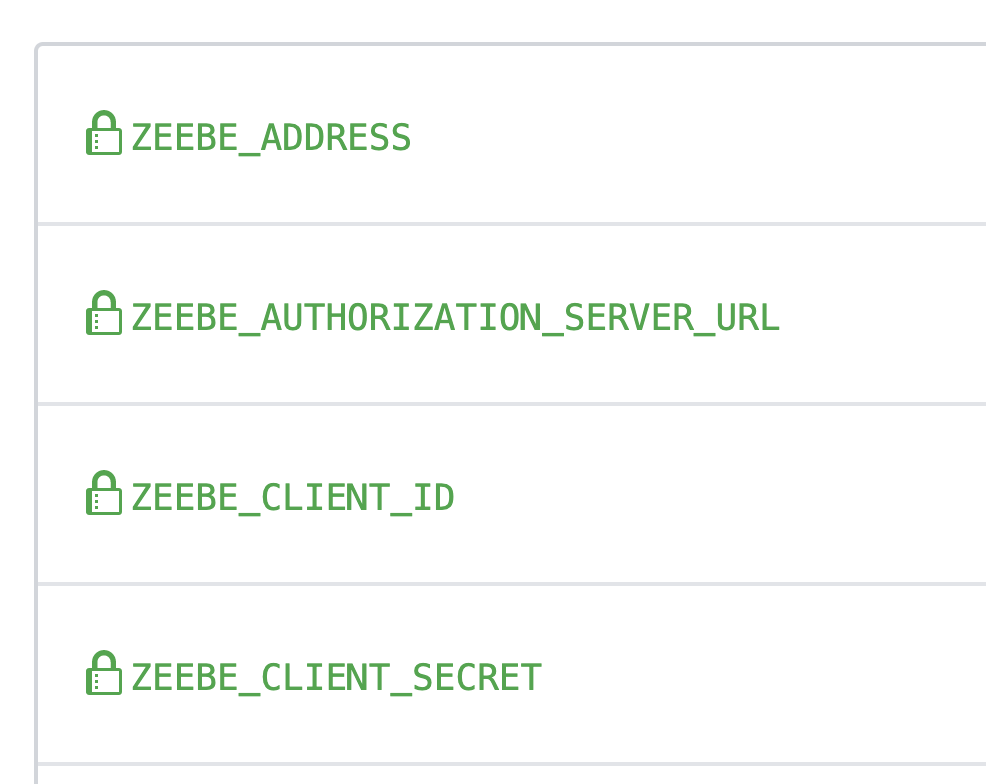

When you hit "Add secret", you should see this:

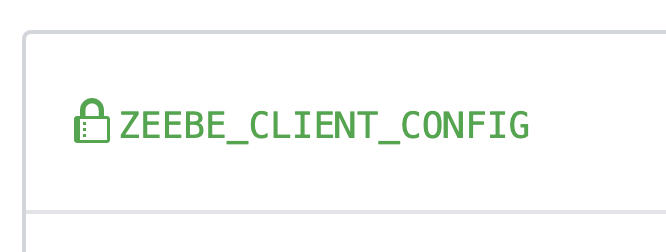

* Now, we will add an app to this repo that lets you trigger GitHub Actions from a web-based UI. Go to [Actions Panel](https://www.actionspanel.app/) and sign in with your GitHub account.

* Install the Actions Panel app to your forked repo.

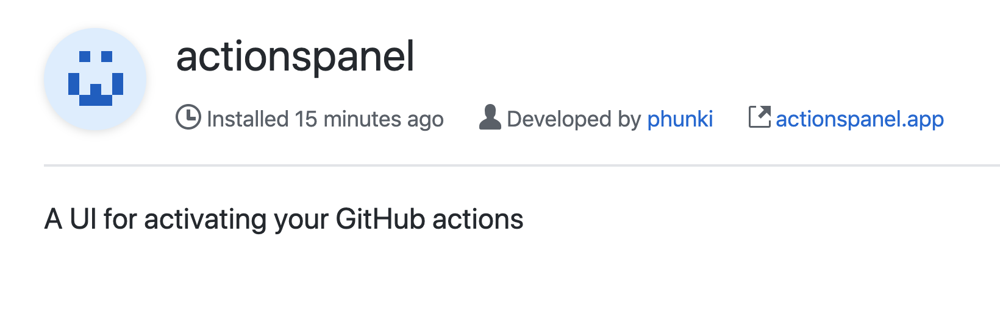

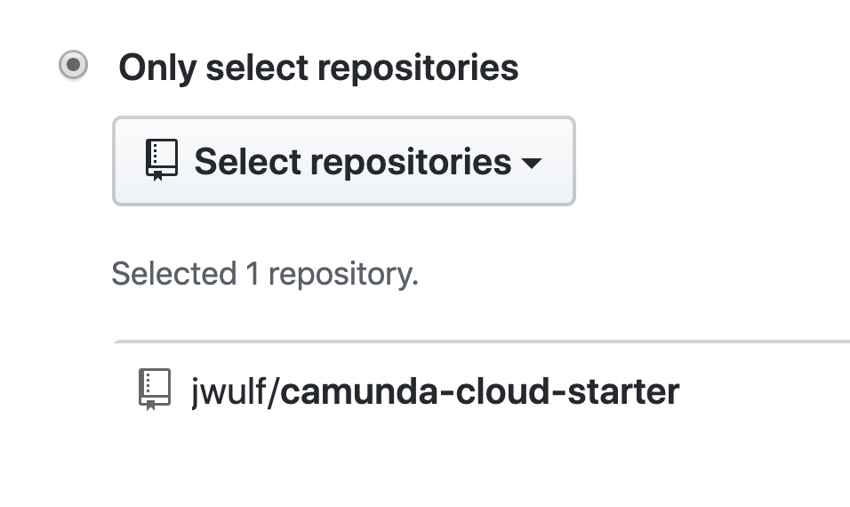

* Go back to [Actions Panel](https://www.actionspanel.app/)

* You now have buttons to run the various demo workflows in this starter.

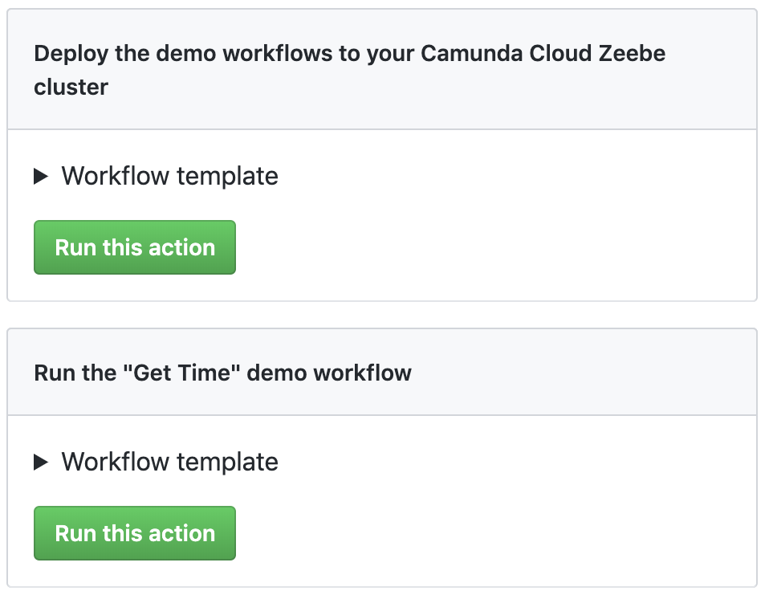

## Deploy the demo workflows

* Open the "Actions" view in your repo in one browser tab.

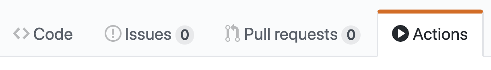

* Open [Actions Panel](https://www.actionspanel.app/) in another browser window.

* In Actions Panel, click on "Run this action" for "_Deploy the demo workflows to your Camunda Cloud Zeebe cluster_". This will deploy the workflows to your cluster.

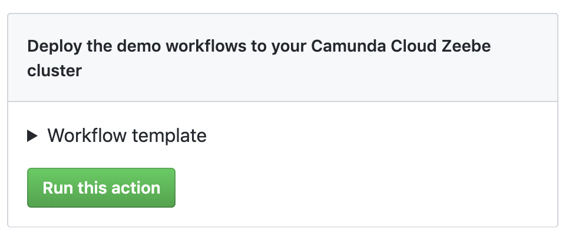

* After you click the button, refresh the Actions view in the other browser window. You will see the "Deploy Workflows" job running.

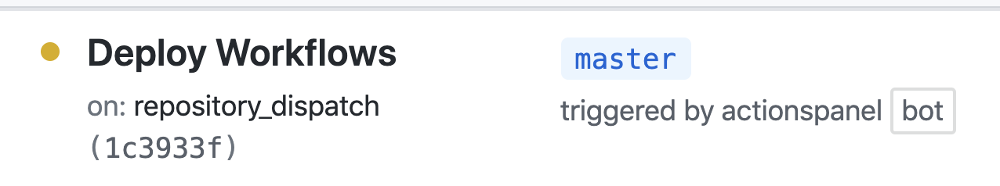

* Click in the details of the job, and you will see the workflows being deployed to the cluster.


* The workflow definitions are now deployed to the cluster. Go to the Camunda Operate dashboard in Camunda Cloud and you will see them there.

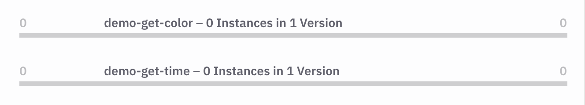

The GitHub Action that deploys the workflows to Camunda Cloud is in [.github/workflows/deploy-workflows.yml](/.github/workflows/deploy-workflows.yml).

Under the hood, the Zeebe GitHub Action uses the [Zeebe Node.js client](https://www.npmjs.com/package/zeebe-node#deploy-a-workflow) to do this (see the Zeebe Action code that does it [here](https://github.com/jwulf/zeebe-action/blob/master/src/main.ts#L88)). 

Note that libraries are available to program [Zeebe clients in a number of popular programming languages](https://docs.zeebe.io/clients/index.html).

## Run the Get Time demo

The Get Time demo model is [bpmn/demo-get-time.bpmn](bpmn/demo-get-time.bpmn).

If you open the model in the [Zeebe Modeler](https://github.com/zeebe-io/zeebe-modeler), you will see this:

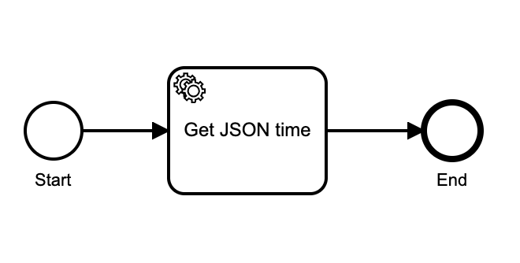

It has a single task in it. The task is serviced by the [Camunda Cloud HTTP Worker](https://github.com/zeebe-io/zeebe-http-worker). This is a task worker hosted in Camunda Cloud that services tasks of type `CAMUNDA-HTTP` and can make REST calls based on the task configuration, adding the JSON payload of the response to the workflow variables.

To use it, you set the task type to `CAMUNDA-HTTP` and set two headers on the task that have particular semantics for this worker: `url` - what it says; and `method` the HTTP method. The task in this demo workflow has the url set to [https://json-api.joshwulf.com/time](https://json-api.joshwulf.com/time) and the `method` set to "get".

In this workflow, it does a GET request to the [Camunda Cloud Demo JSON API](https://github.com/jwulf/camunda-cloud-demo-json-api) to get the current time as a JSON object.

Let's create an instance of this workflow. We will be running [.github/workflows/demo-get-time.bpmn](.github/workflows/demo-get-time.yaml).

* In your [Actions Panel](https://www.actionspanel.app/), click on "Run this action" for "_Run the "Get Time" demo workflow_".

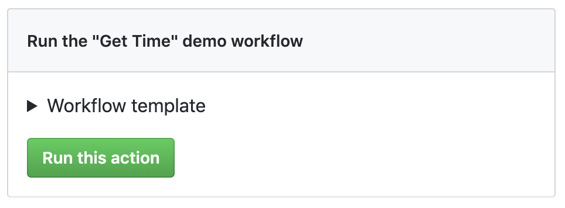

* In the Actions view of your repo, you will see the "Run Get Time Demo" running. The code for this is in [.github/workflows/demo-get-time.yml].

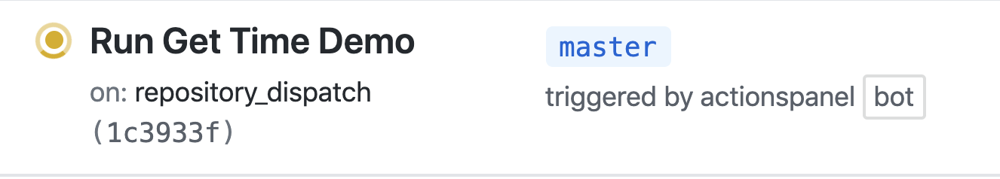

* Click into it, and you will see the outcome of the workflow:

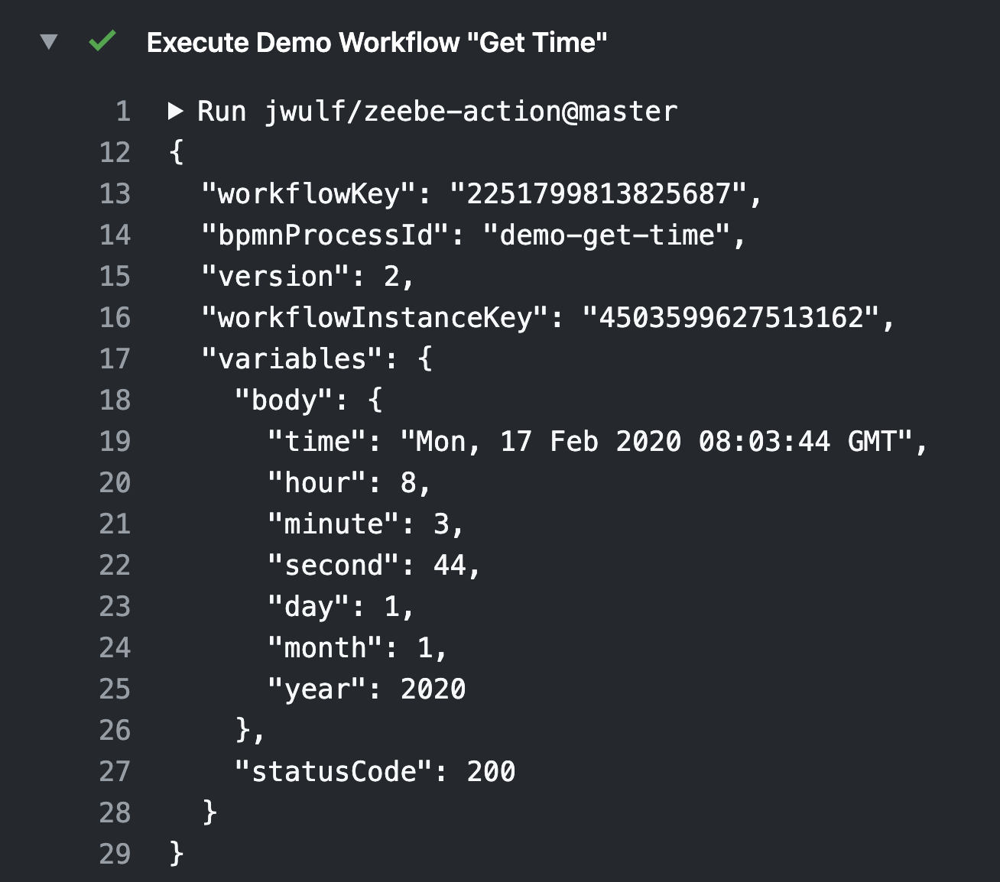

The response from the call to the JSON API has been added to the workflow variables.

## Creating a workflow and awaiting the outcome 

We see the output of the workflow here because we used the [`createWorkflowInstanceWithResult`](https://docs.zeebe.io/reference/grpc.html#createworkflowinstance-rpc) call. This call creates a workflow instance, and awaits the result.

Under the hood, the Zeebe GitHub Action uses the Node.js client (see the implementation [here](https://github.com/jwulf/zeebe-action/blob/master/src/main.ts)), and this command is documented for the Node client [here](https://zeebe.joshwulf.com/createwf/createwf/#create-a-workflow-instance-and-await-its-outcome). You can use it with any [Zeebe client library](https://docs.zeebe.io/clients/index.html).

This pattern is useful for short-lived processes, where the creator of the workflow will also act on the outcome - including passing it back to a requestor (for example inside a REST response). See [this blog post](https://zeebe.io/blog/2019/10/0.22-awaitable-outcomes/) for more information.

## Mapping variables

If you have a workflow that makes a number of REST calls, you don't want subsequent tasks to overwrite the results of previous calls.

You can accomplish this by creating variable mappings on your tasks. In the next demo [bpmn/demo-get-time-2.bpmn](bpmn/demo-get-time-2.bpmn), we create a mapping on the "Get JSON time" task to map the `body` variable to a new `time_from_api` variable.

Here is what that looks like in the [Zeebe Modeler](https://github.com/zeebe-io/zeebe-modeler): 

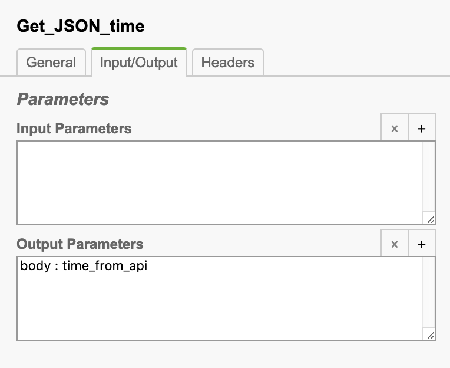

And in the model XML: 

```XML
<zeebe:ioMapping>
    <zeebe:output source="body" target="time_from_api" />
</zeebe:ioMapping>
```

## Let's run the demo!

* In [Actions Panel](https://www.actionspanel.app/) click the _Run the "Get Time No. 2" demo workflow_ button.

The "Run Get Time Demo 2" workflow will run in your repo's Actions.

This time you will see output similar to the following:

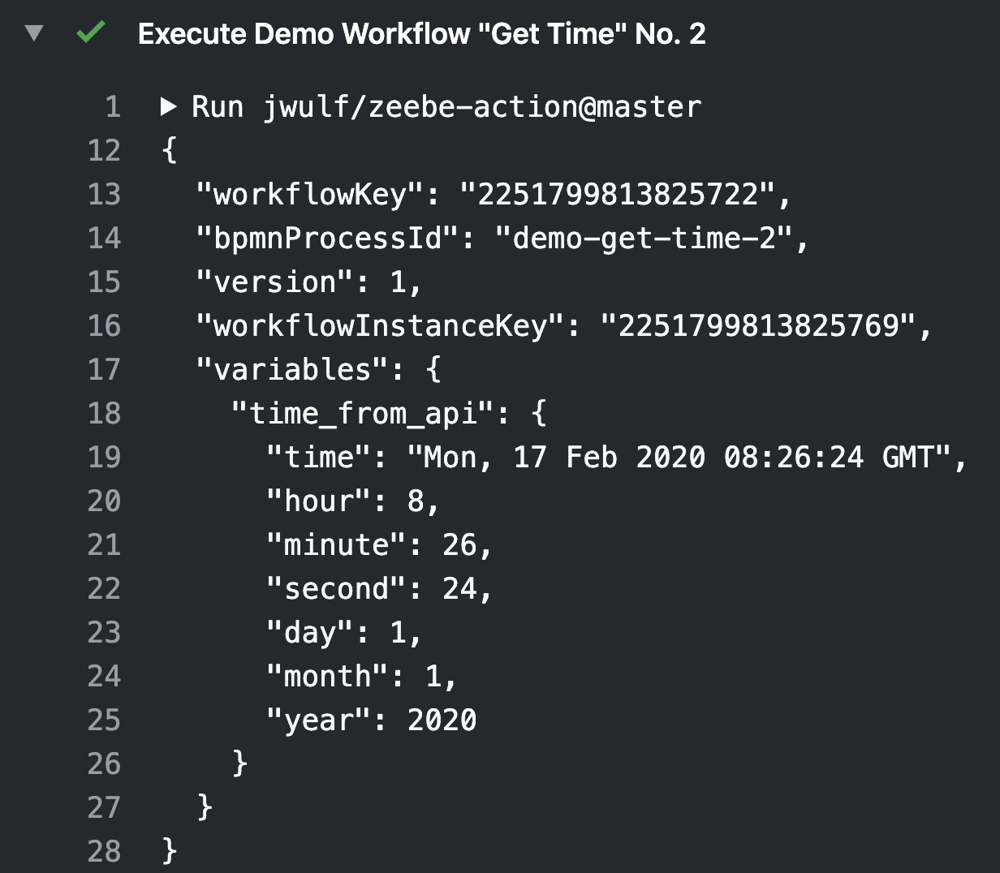

The value of the response from the JSON API has been mapped to the variable `time_from_api` in the workflow variables. 

Note that the status code, which was present in the first demo as the `status` variable, is gone. Once you map one variable on the output, you need to map _all_ the variables that you want. So it acts to both map _and_ constrain the variables that are added to the workflow variables. Handy.

## Make a Decision

In the next demo, we will use a model that makes a decision based on the current time from the JSON API.

Here is the model, which you can find in [bpmn/demo-get-greeting.bpmn](bpmn/demo-get-greeting.bpmn):


This workflow will get the time from the JSON API, then branch based on the current hour, and add a time-appropriate greeting string to the worker variables.

The last branch has no condition because it is the _default flow_. Every conditional must have one (see [here](https://forum.zeebe.io/t/bpmn-exclusive-or-gateway-workflow-using-zeebe-java-client/997/6) for why that is). If no other condition matches, it will take this flow.

Let's run the demo!

* Go to [Actions Panel](https://www.actionspanel.app/) and click the _Run the "Get Greeting" demo workflow_ button.

In your repo's Actions you will see the "Run Get Greeting" workflow run, and you'll see output similar to the following, depending on the time of day that you run this (note that the API returns the GMT time):

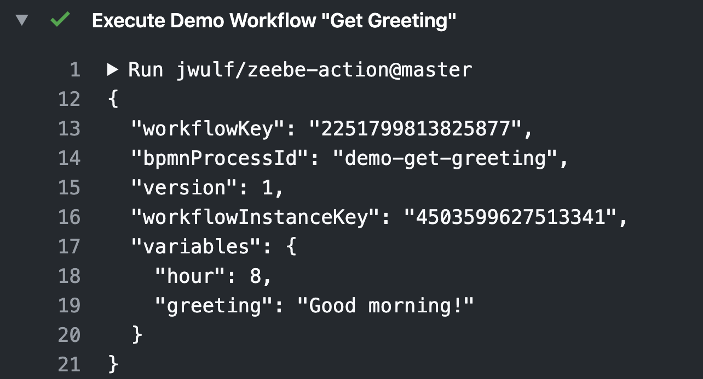

This time, we constrained the workflow payload to just the hour by mapping it in the output of the "Get JSON time" task:

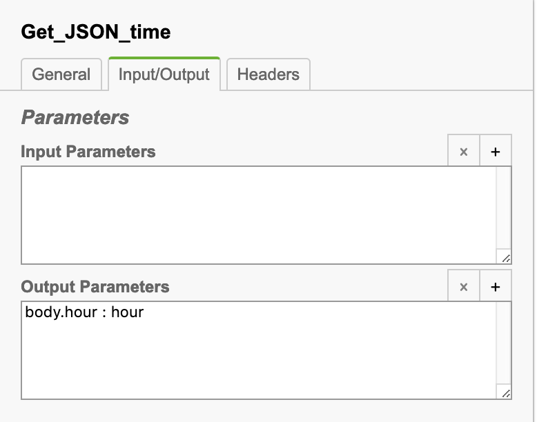

The decision branches then examine the value of the `hour` workflow variable to determine which branch to take, using a [condition expression](https://docs.zeebe.io/reference/conditions.html):

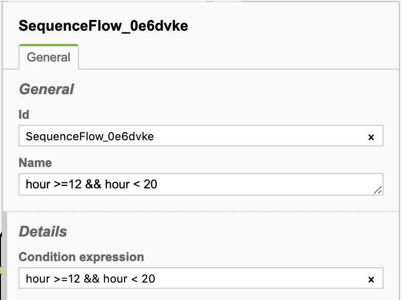

How we get the appropriate greeting into the payload is an ingenious workaround - aka a HACK - for running this workflow with no workers other than the HTTP worker.

Each of the tasks after the branch makes another call to the JSON time endpoint, which is thrown away. On the output of each task, however, we map a variable to the `greeting` variable of the workflow.

For example:

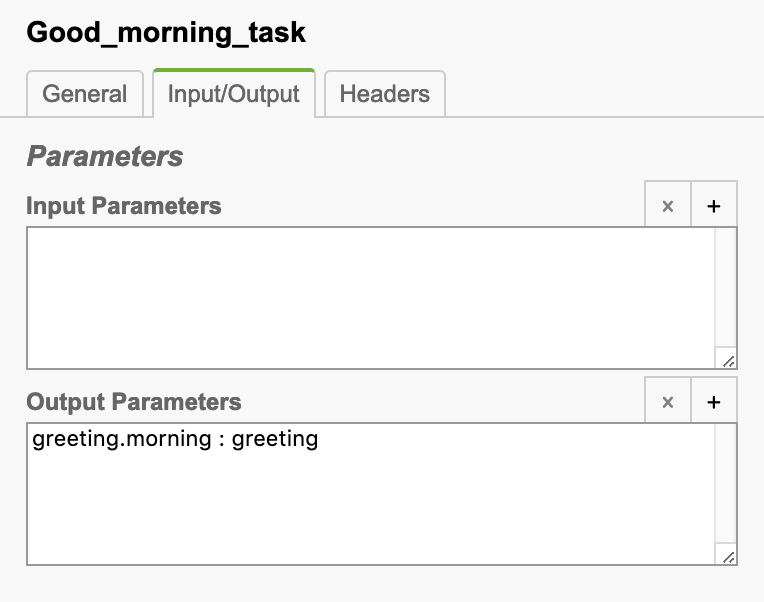

Where did that `greeting.morning` variable come from? 

_We pass it into the workflow as a dictionary when we start the workflow_. Take a look at [.github/workflows/demo-get-greeting.yml](.github/workflows/demo-get-greeting.yml). Here's the relevant section:

```
- name: Execute Demo Workflow "Get Greeting"
  uses: jwulf/zeebe-action@master
  with:
    operation: createWorkflowInstanceWithResult
    bpmn_process_id: demo-get-greeting
    variables: '{"greeting":{"morning":"Good morning!","afternoon":"Good afternoon!","night":"Good night!"}}'
```

The output mapping overwrote the dictionary, to keep the output clean for this demo.

There is work ongoing to make it possible to use string constants in task definitions (see [the feature in progress here](https://github.com/zeebe-io/zeebe/issues/3417)).

In the meantime, it is possible to work around it by including a "no-op" task, and mapping from a constants dictionary that you pass into the workflow when you create it. 

However, at this point, we're reaching the limits of what we can do without writing our own custom task workers. Note, also, that with this coupling it is difficult to test this without mocking the JSON endpoint to be able to change time.

So let's do this again with a Zeebe Worker serving a task to generate the greeting based on the time that is passed to it.

## Writing a Zeebe Worker 

A Zeebe Worker is a process that connects to Camunda Cloud over gRPC and polls for available work for a particular task type, using the [`activateJobs`](https://docs.zeebe.io/reference/grpc.html?highlight=activateJobs#activatejobs-rpc) command. It uses [long-polling to reduce load](https://zeebe.io/blog/2019/08/long-polling/).

When the Zeebe broker in Camunda Cloud has a job for the worker's task type, it streams the job to the worker. The worker then does what it does, and returns the completed job to the broker. It can also fail the job (basically the equivalent of throwing an exception), or throw a business error (BPMN Error event). 

In this demo, however, we will only consider the happy path.

The model for this demo is in [bpmn/demo-get-greeting-2.bpmn](bpmn/get-greeting-2.bpmn). In the Zeebe Modeler it looks like this: 

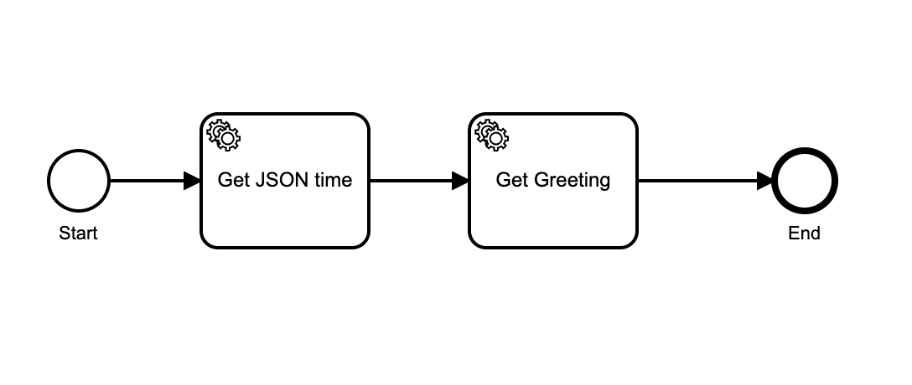

The first task uses the Camunda HTTP Worker (a hosted instance of the [Zeebe HTTP Worker](https://github.com/zeebe-io/zeebe-http-worker)) to call the demo JSON time API. It has a task type of `CAMUNDA-HTTP`.

The second task has a task type of `get-greeting`:

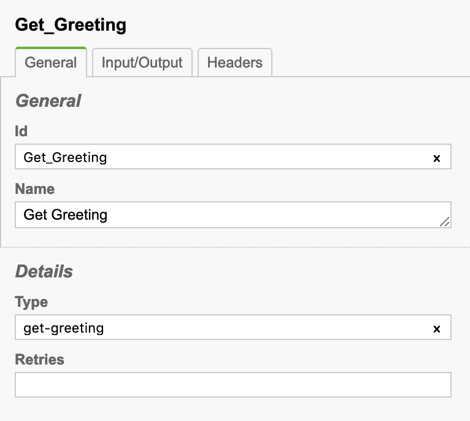

There is no worker listening for this task type in your cluster, so we need to start one.

The file [workers/greeting.js](workers/greeting.js) contains a Worker handler function for a Node.js worker. 

You can write Zeebe workers in any of [a number of popular programming languages](https://docs.zeebe.io/clients/index.html). The [Zeebe GitHub Action](https://github.com/marketplace/actions/zeebe-action) that we are using for these demos just happens to be written in JavaScript using the [Zeebe Node.js client](https://www.npmjs.com/package/zeebe-node).

The worker job handler is a simple callback function that takes a `job` and a `complete` function.

```javascript
module.exports = {
  tasks: {
    "get-greeting": (job, complete) => {
      core.info("===Worker===")
      core.info(`Got a job from Camunda Cloud:`);
      core.info(JSON.stringify(job, null, 2));
      core.info("===Worker===")
      const { hour } = job.variables;
      let greeting;
      if (hour > 5 && hour < 12) {
        greeting = "Good morning!";
      } else if (hour >= 12 && hour < 20) {
        greeting = "Good afternoon";
      } else {
        greeting = "Good night!";
      }
      complete.success({ greeting });
    }
  }
};
```

It also contains the code to create and await a workflow instance, print the outcome, and exit:

```javascript
zbc.createWorkflowInstanceWithResult("demo-get-greeting-2", {})
.then(res => {
  core.info("===Outcome to Requestor===");
  core.info(JSON.stringify(res, null, 2));
  core.info("===Outcome to Requestor===");
  setTimeout(() => zbc.close().then(() => process.exit(0)), 500);
});
```

Let's run the demo and see it at work!

* Go to [Actions Panel](https://www.actionspanel.app/) and click the button to _Run the "Get Greeting No. 2" demo workflow_.

* In your repo's Actions view you will see something like this:

```
===Worker===
Got a job from Camunda Cloud:
{
  "key": "2251799813826172",
  "type": "get-greeting",
  "workflowInstanceKey": "2251799813826160",
  "bpmnProcessId": "demo-get-greeting-2",
  "workflowDefinitionVersion": 1,
  "workflowKey": "2251799813826096",
  "elementId": "Get_Greeting",
  "elementInstanceKey": "2251799813826171",
  "customHeaders": {},
  "worker": "e139975d-31b9-4feb-bc11-03ceaba161f6",
  "retries": 3,
  "deadline": "1581934619467",
  "variables": {
    "hour": 10
  }
}
===Worker===
===Outcome to Requestor===
{
  "workflowKey": "2251799813826096",
  "bpmnProcessId": "demo-get-greeting-2",
  "version": 1,
  "workflowInstanceKey": "2251799813826160",
  "variables": {
    "hour": 10,
    "greeting": "Good morning!"
  }
}
===Outcome to Requestor===
```

Here you can see the `job` object that the worker receives from Camunda Cloud. The UUID for `worker` is the auto-generated id for this worker. The Zeebe broker knows that the job has been streamed to this worker, and keeps track of how long it has had it. If the worker doesn't complete the job within a [specified period of time](https://www.npmjs.com/package/zeebe-node#create-a-task-worker), the broker will time it out and give the job to another worker.

Our worker, however, did its job, calculated the correct greeting based on the time in the job variables, and sent back the appropriate greeting.

The response object passed to `complete.success` by the worker was merged with the existing workflow variables.

In contrast to baking it into the model, this worker function is easy to unit test, as it is decoupled from the time input.

## Next Steps

OK, that's a basic getting started with Camunda Cloud. Maybe you are ready to start writing your own workers locally - in which case you can find a client library in [your favorite programming language](https://docs.zeebe.io/clients/index.html) and get started now.

Or, you might like to look at a more advanced use-case in this repo - an [ecommerce order flow that demonstrates correlating messages with a running workflow instance](ADVANCED.md).